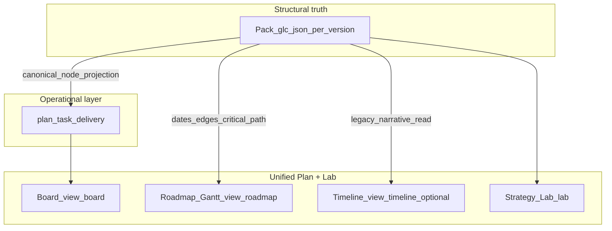

# ADR: Delivery Board replaces narrative Timeline (product + ticket artefact — Accepted v1)

| Field | Value |
| --- | --- |
| **Status** | **Accepted** |
| **Date** | 2026-05-03 |
| **Scope** | One execution contour: Pack (structural truth) + `plan_task_delivery` (soft state) + three Plan views (**Board**, **Roadmap Gantt**, **Strategy Lab**). Narrative `?view=timeline` sunsets after parity ([`ADR-DELIVERY-BOARD-OPERATIONAL-LAYER.md`](./ADR-DELIVERY-BOARD-OPERATIONAL-LAYER.md) Appendix F/G). |
| **Supersedes** | — (does **not** replace engineering SSOT yet) |
| **Superseded by** | — |
| **Relationship to OPERATIONAL-LAYER** | **`ADR-DELIVERY-BOARD-OPERATIONAL-LAYER.md` remains Accepted** engineering + implementation SSOT (**Appendix D** = spec vs shipped). **This ADR** is the **product decision matrix §2**, **risk register**, and **ticket skeleton (GLC-PB-xxx)** aligned to that codebase. Promotion to **Accepted** here would mean product explicitly adopts this wording as authoritative for scope tickets—without invalidating OPERATIONAL-LAYER until a superseding engineering ADR states otherwise. |
| **Decision owners** | Product + Consulting + AI Platform |

### Related artefacts

- Engineering SSOT + paths: [**`ADR-DELIVERY-BOARD-OPERATIONAL-LAYER.md`**](./ADR-DELIVERY-BOARD-OPERATIONAL-LAYER.md)
- Deferred epics index: [**`ADR-DELIVERY-BOARD-FOLLOWUP-EPICS.md`**](./ADR-DELIVERY-BOARD-FOLLOWUP-EPICS.md)
- Canonical key Epic 1: [**`ADR-PRESERVE-CANONICAL-NODE-KEY-EPIC1.md`**](./ADR-PRESERVE-CANONICAL-NODE-KEY-EPIC1.md)
- Human prompt canon: [`docs/instructions/ORCHESTRATOR-INSTRUCTIONS.md`](../instructions/ORCHESTRATOR-INSTRUCTIONS.md)
- Deploy / env matrix: [`docs/DEPLOYMENT.md`](../DEPLOYMENT.md)

---

## 1. Context

Consultants and clients hit an overloaded toolchain: Strategy Lab orchestration chrome, Roadmap Gantt density, and a **read-only narrative Timeline** did not expose **manageable operational state**. Users need one mental model—**same audit, same pack**—with surfaces split by job-to-be-done: **manage flow** (Board), **read time and dependencies** (Roadmap), **edit manifest and rebuild pack** (Lab).

Pack JSON stays **immutable per `orchestration_pack_version`**; operational columns/positions are **never** merged back into the graph as silent writes (hybrid “2.1-C” is deferred per follow-up ADR queue).

---

## 2. Architecture (three layers)

- **Cross-view:** single `?focus=<canonical_node_key>` contract ([`plan-cross-nav`](../../src/app/lib/plan-cross-nav.ts)); **one PATCH** mutation path and **one** React Query namespace for board reads (**`plan-board-queries`**).

---

## 3. Boundary decisions §2 (recommended defaults — commit on P0 as product artefacts)

These six decisions unblock Phase work; engineering mapping remains in **`ADR-DELIVERY-BOARD-OPERATIONAL-LAYER`**.

| # | Question | Recommendation | Why / trade-off |
| --- | --- | --- | --- |
| **2.1** | Management model | **A** on P0–P1; hybrid **C** on P2+ | Soft state preserves pack determinism; model “B” risks drift vs rebuild. Cursor cookbook aligns. Lane/owner back to manifest deferred to its own epic. |
| **2.2** | Stable id | **`canonical_node_key`** from manifest signature material + lane + title slug (**optional `board_identity_key`** for benign renames — see Epic 1 ADR); **`pack_graph_node_id`** advisory | Pack `node_id` can change across versions; reconcile keys off canonical key. |
| **2.3** | Backlog outside pack | **`source='manual'`** allowed. **Strict variant:** block **`in_progress`** without a pack node until consultant explicitly promotes—**currently shipped differs** (see Appendix Z); tighten only with product sign-off + transition tests. |
| **2.4** | Duplicate mutations | **One** PATCH endpoint for column/position/pin; Roadmap drawer and Board share **`usePatchPlanBoardCardMutation`** pattern | Avoids ghost state and dual-write races. |
| **2.5** | Degradation | Read-only board paths + banner; governance blocked → **409**; CTA Strategy Lab mirrors narrative Timeline degraded envelope | Keeps parity of “do not mutate on bad plan”. |
| **2.6** | Conflicts | Optimistic UI + **`expected_pack_version`**; **409** refresh; merges only via **reconcile** after pack persist | Simple; TD-024 documents rare reconcile vs PATCH overlap—see Operational ADR Appendix C. |

---

## 4. Out of scope (P0–P3)

- Bi-directional sync **calendar dates ↔ kanban columns** without manifest/pack rebuild.
- External trackers (Jira / Linear export as operational write path).
- **Per-audit custom columns** persisting beyond config defaults (defer to follow-up epics).

---

## 5. UX contract clause (Orchestrator)

The clause in **[`ORCHESTRATOR-INSTRUCTIONS.md`](../instructions/ORCHESTRATOR-INSTRUCTIONS.md)** § **UX contract** must stay technically accurate (exact env keys, rollout facade). Delivery Board is the primary execution surface; legacy `?view=timeline` links are retired via canonical redirect to `?view=board`.

---

## 6. Risk register (summary)

| Risk | Mitigation (shipped / planned) |
| --- | --- |
| Operational state orphaned on semantic rename | Orphan badges + reconcile; Epic 1 optional stable key ([`ADR-PRESERVE-CANONICAL-NODE-KEY-EPIC1`](./ADR-PRESERVE-CANONICAL-NODE-KEY-EPIC1.md)); Strategy Lab messaging. |
| Users confuse Board vs Timeline pre-parity | Segmented labels; **`DEPLOYMENT.md`** runbook; default `view` resolves from rollout (`portal-plan`). |
| Reconcile overlaps PATCH | Idempotent reconcile + versioning; Operational ADR Appendix C / **TD-024** `accepted_risk` until escalation. |
| Consultant expects boolean “board on/off” in docs vs staged rollout | **Appendix Z** clarifies rollout mode env parity with SPA (**`FEATURE_PLAN_DELIVERY_BOARD_ROLLOUT_MODE`**). |

---

## 7. Phased delivery — GLC-PB ticket skeleton + repo status

**Normative acceptance per phase:** align tests and [`docs/API.md`](../API.md) with [**`ADR-DELIVERY-BOARD-OPERATIONAL-LAYER`**](ADR-DELIVERY-BOARD-OPERATIONAL-LAYER.md), not verbatim rows below where they diverge (**Appendix Z**).

| ID | Phase | Description | Repo status |
| --- | --- | --- | --- |
| **GLC-PB-001** | P0 | ADR §2 locked by product + UX contract synced | **Split:** engineering **Accepted** in **Operational-layer** ADR; **this document** carries **Proposed** product framing. |
| **GLC-PB-002** | P0 | `?view=board` parser + segmented **Board \| Roadmap \| Timeline** | **Done** — [`portal-plan.ts`](../../src/app/config/portal-plan.ts), [`PortalPlanPage.tsx`](../../src/app/pages/portal-plan/PortalPlanPage.tsx); redirect tests [`LegacyPlanPathRedirect`](../../src/app/pages/portal-plan/LegacyPlanPathRedirect.tsx). |
| **GLC-PB-003** | P0 | Read-only prototype from timeline projection only | **Superseded / differs** — shipped **persisted operational** Board + parity (`timeline_parity` on GET)—see Operational ADR SSOT mapping. |
| **GLC-PB-004** | P1 | Migration `074` / adjunct `075` `plan_task_delivery` | **Done** — [`074_plan_task_delivery.sql`](../../server/migrations/074_plan_task_delivery.sql), [`075_plan_task_delivery_manual_title.sql`](../../server/migrations/075_plan_task_delivery_manual_title.sql). |
| **GLC-PB-005** | P1 | `canonical_node_key` in **`@glc/intake-core`** (+ optional identity key tract) | **Done** — [`canonical-node-key.ts`](../../packages/intake-core/src/canonical-node-key.ts) + tests. |
| **GLC-PB-006** | P1 | `GET …/plan/board` + Zod | **Done** — [`get-plan-board.controller.ts`](../../server/src/routes/audits/controllers/get-plan-board.controller.ts), [`plan-board.ts` schema](../../server/src/schemas/plan-board.ts); client hooks [`plan-board-queries.ts`](../../src/app/data/api/plan-board-queries.ts). |
| **GLC-PB-007** | P1 | `reconcileBoardWithPack` + `plan_board_reconciled` | **Done** — [`reconcile.ts`](../../server/src/services/plan-board/reconcile.ts), [`reconcile-pack.service.ts`](../../server/src/services/plan-board/reconcile-pack.service.ts); tests [`plan-board-reconcile.test.ts`](../../server/src/tests/plan-board-reconcile.test.ts). |
| **GLC-PB-008** | P1 | `PATCH …/cards/:id` + `expected_pack_version` + Idempotency-Key | **Done** — [`patch-plan-board-card.controller.ts`](../../server/src/routes/audits/controllers/patch-plan-board-card.controller.ts). |
| **GLC-PB-009** | P1 | `@dnd-kit` + keyboard Move-to menu | **Done** — [`BoardView.tsx`](../../src/app/pages/portal-plan/board/BoardView.tsx); `react-dnd` removed (`package.json`); RTL + [`jest-axe` a11y test](../../src/app/pages/portal-plan/board/__tests__/PlanBoardOperationalCard.a11y.test.tsx). |
| **GLC-PB-010** | P1 | `plan-cross-nav` focus param | **Done** — [`plan-cross-nav.ts`](../../src/app/lib/plan-cross-nav.ts). |
| **GLC-PB-011** | P1 | Flags in facades + `.env.example` | **Done (differs naming)** — rollout **`FEATURE_PLAN_DELIVERY_BOARD_ROLLOUT_MODE`** vs legacy boolean wording—**Appendix Z**; parity test [`orchestration-contract-parity`](../../src/app/config/orchestration-contract-parity.test.ts). |
| **GLC-PB-012** | P2 | `POST …/cards` manual | **Done** — routes under [`audits/index.ts`](../../server/src/routes/audits/index.ts). |
| **GLC-PB-013** | P2 | Reconciliation panel UX | **Done (lean)** — consultant orphan banner + `POST …/reconcile` in [`BoardView.tsx`](../../src/app/pages/portal-plan/board/BoardView.tsx) (full “diff preview panel” deferred if product wants richer UI). |
| **GLC-PB-014** | P2 | Orphan badges | **Done** — Board card chrome. |
| **GLC-PB-015** | P3 | `top_7d`/`top_30d` parity on cards | **Done** via **`timeline_parity`** + Board consumption (+ optional `GET /timeline` defer toggle). |
| **GLC-PB-016** | P3 | Sunset `view=timeline` | **Done** — defaults + redirects per Operational ADR **Appendix F**; legacy timeline remains redirect-only. |

---

## 8. Appendix Z — Delta vs original draft §3 / §7 (shipped baseline)

Canonical engineering truth: **`ADR-DELIVERY-BOARD-OPERATIONAL-LAYER` Appendix D** + codebase.

| Topic | Draft/conversation spec | **Shipped** |
| --- | --- | --- |
| `plan_task_delivery.user_id` | NOT NULL audit owner column | **No** duplicated `user_id` row; **`created_by_user_id`** + RLS via audit ownership / **`client_id`**—see Operational ADR Decision §4 |
| `canonical_node_key nullability` | NOT NULL everywhere | **`NULL`** for **`source='manual'`** enforced by migration CHECK ([`074`](../../server/migrations/074_plan_task_delivery.sql)) |
| Extra columns | Not in draft `§3` | **`pack_lane_snapshot`**, **`manual_title`** (**`075`**), orphan reasons enumerated in schema |
| Board enable flag | **`PLAN_DELIVERY_BOARD`** boolean default false | **Rollout facade** **`planDeliveryBoardRolloutMode`** / **`FEATURE_PLAN_DELIVERY_BOARD_ROLLOUT_MODE`** (**`shadow`…`ga`**) per [`feature-flags.ts`](../../server/src/config/feature-flags.ts) |
| Narrative Timeline | Flagged fallback | Retired: canonical route keeps permanent redirect `?view=timeline` → `?view=board` |
| Reconcile module path | `services/plan-board-reconcile.ts` | **`services/plan-board/reconcile.ts`** + persistence adapter |
| §**2.3** strict enforce | Ban manual **`in_progress`** without pack promote | **Current policy allows** flagged transition with UI warning—tightening = product change + server transition matrix update |

---

## 9. ADR lifecycle

- This ADR is **Accepted** as the product-facing decision matrix and execution backlog frame; engineering implementation SSOT remains [`ADR-DELIVERY-BOARD-OPERATIONAL-LAYER.md`](./ADR-DELIVERY-BOARD-OPERATIONAL-LAYER.md).
- If schema/flag behavior must tighten beyond Appendix Z, publish a new ADR (do not rewrite accepted decision sections in place).
