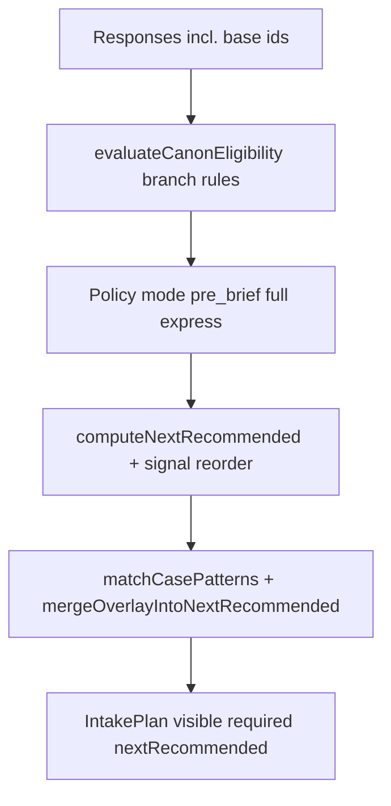

# ADR: Intake personalization — product scope, two-phase UX map, and Sprint C priorities

**Status:** Accepted (product + engineering reference)  
**Date:** 2026-04-24  
**Context:** [QUESTION_BANK.md §1](../QUESTION_BANK.md) (diagnosis vs conversational goal), [ADR-DIAGNOSTIC-ADAPTIVE-INTAKE-ROADMAP-AUDIT.md](./ADR-DIAGNOSTIC-ADAPTIVE-INTAKE-ROADMAP-AUDIT.md) (F1 vs F2, Sprint C)

## 1. Scope: situational copy vs orchestration (what to build when)

This section **fixes the product scope** for “situational questions” and “feels personal, not a template” without assuming a single implementation.

### 1.1 Three layers (dependencies and risk)

| Layer | Mechanism | Primary outcome | Latency / risk | Dependency |
| --- | --- | --- | --- | --- |
| **A — Rule-based UX** | Short **lead-in** lines derived from *already known* answers (templates + `replaceIntakePublicCopyPlaceholders` pattern); **deepen** nudges on weak free-text; **case overlays** and vertical bank ids in [`intake-case-patterns.v1.json`](../../packages/intake-core/src/artifacts/intake-case-patterns.v1.json) | Same bank ids, **richer** framing; addresses “template” *copy* first | Low: deterministic, testable | Editorial + small UI; optional new placeholder keys in bank/overrides with lint |
| **B — Schema + two-phase presentation** | Canon **placeholders in labels/hints** (e.g. industry, stage); explicit **user-facing** “must-have for report / SLA” vs “optional depth” *sections* driven off plan fields (see §2) | Clear **mental model**; minimal missing context before enrichment | Medium: i18n, accessibility, versioned bank rows | `buildIntakePlan` already exposes the signals; UI strings and layout work |
| **C — LLM orchestration** | **F2:** model suggests `next` `questionId` **only** if validated ⊆ eligible/overlay-resolved set ([ADR-INTAKE-NEXT-QUESTION-V1](./ADR-INTAKE-NEXT-QUESTION-V1.md)). Optional **separate** track: LLM **paraphrase** of a fixed bank stem for display | “Dialogue-like” *ordering* (F2) and/or *wording* (paraphrase) | Higher: cost, PII, drift, invalid-suggestion KPI, legal review for NL | F2: new ADR + server path + shadow KPI. Paraphrase: **not** F2; needs its own DPA/safety line item |

**Decision (normative):**

1. **Ship A before B** where the goal is *perceived* personalization: fastest ROI, no new runtime contracts.
2. **B** reuses existing plan outputs; it does *not* require F2. Prefer explicit phase copy over duplicate bank rows.
3. **C — F2** remains optional until product prioritization; it **must not** bypass `minimumSufficientContext` or policy.
4. **C — paraphrase** is a distinct capability from F2: same `questionId`, variable display string — still needs golden tests and rollback to bank label on failure.

### 1.2 What F2 does and does not solve

- **F2 helps:** order within the eligible set, “conversational” *next step* for pilot users.  
- **F2 does not replace:** case overlays, branch rules, or stop policy; see [ADR-INTAKE-NEXT-QUESTION-V1](./ADR-INTAKE-NEXT-QUESTION-V1.md).  
- **LLM paraphrase** targets “same question, sounds about *this* business” but adds QA and trust burden; layer A + B may satisfy many segments without it.

---

## 2. Map: `IntakePlan` and user-facing “two phases”

The resolver already distinguishes **gaps** vs **suggested order**. The **product gap** is mostly **labeling and layout**, not a second planner.

`IntakePlan` fields (see [`types.ts` — `IntakePlan`](../../packages/intake-core/src/core/types.ts)):

| Plan concept | Meaning | Map to user-facing “Phase 1” (minimal missing) | Map to “Phase 2” (depth / improvement) |
| --- | --- | --- | --- |
| `missingForReport` | Domains with unanswered **SLA-visible primary-feed** questions | “We still need this for your report / audit inputs” (ties to [`IntakeBankWizard`](../FRONTEND.md) gap copy patterns) | N/A when empty |
| `required` (SLA) | Must answer for **mode** (e.g. full vs express) | Primary block; blockers for submit / pipeline | After required: optional |
| `nextRecommended` | **Suggested order** (required → recommended → optional primaries for `missing` domains) | **Head of queue** = next best *necessary* step when policy says so | Tail = refinements, optional primaries, **post-stop** if user continues |
| `criticalSignals` / `remediation` | Pilot signal confidence and **short** remediation queue (≤2 ids) | “Close these gaps to sharpen recommendations” | After signals ≥ threshold, optional **precision** work |
| `casePatternMatch` | `activeOverlayQuestionIds`, `stopConditionMetByCase` | Overlay ids **prepending** to queue — *case-relevant* “missing” in context of matched cases | Unanswered **optional** overlay can **prune** after stop + `minOverlayAnswered` (policy) — user sees fewer generic follow-ons |
| F1 / `decideIntakeNextQuestion` | `nextRecommended[0]` or **stop** when min-sufficient passes | “Minimal context” for stop is **policy-defined** ([`intake-next-question.ts`](../../packages/intake-core/src/core/intake-next-question.ts)), not “all questions” | “Precision” = continuing after stop or **guided rail** (Fast vs Precision) — *UX*, same engine |

**Today’s UI signals (for parity):** client guided **Fast Pass / Precision Pass** rail, “Still unclear:” / report gap chips, F1 `next-question` for pilot. **Not yet normative:** a single global section header that splits the wizard into only-two phases; that is **documented as the intended B-layer presentation** to implement when product prioritizes it.

**Anti-pattern:** don’t conflate *Phase 2* with *more questions* only — Phase 2 should read as *optional* or *higher* signal confidence, aligned with `minimumSufficientContext` and case stop prunes.

---

## 3. Base (minimum) vs personalized questions (normative)

**Base — the pre-brief *operational* spine, not a “fully revealed” client:** the **shared** bank id list for the public pre-brief link: `modes.pre_brief.identityFieldIds` + `modes.pre_brief.bankIncluded` in [`intake-policy.v1.json`](../../packages/intake-core/src/intake-policy.v1.json). In code, the **ordered** list is **`INTAKE_MINIMUM_CONTEXT_BANK_IDS`** (and membership check **`isIntakeMinimumContextBankId`**) in [`intake-base-context-ids.ts`](../../packages/intake-core/src/intake-base-context-ids.ts); membership matches **`PRE_BRIEF_PARTICIPATION_IDS`** in [`intake-brief-catalog-meta.ts`](../../packages/intake-core/src/intake-brief-catalog-meta.ts).

**What this minimum deliberately is *not*:** it is **not** a substitute for deep discovery. Pre-brief is sized for a **short, low-friction** capture (who they are, rough situation, high-level pain/goals) so the consultant and pipeline can **start** — it does **not** by itself “fully open up” the client (motivations, nuance, exact scope of the engagement, or proof that the stated `f1` / `f2` / `f8` answers are enough). **That depth** is the job of **full intake** (remaining bank + branches + case overlays + interview / consultant layer), and of **personalized** sequencing after the base, not of expanding the pre-brief id list to become a second full questionnaire.

**Naming hygiene:** use **“pre-brief baseline”** or **“link-capture minimum”** in stakeholder copy when you need to avoid implying that this set equals “we already know them.”

| Role | Bank ids (v1) | Intent |
| --- | --- | --- |
| Identity | `a5`, `a11`, `a12`, `a2` | Company, contact, industry (+ `intake_industry_specify` when *Other*) |
| Situation + goals (pre-brief bank) | `f1`, `f2`, `f8`, `a7`, `b1`, `a10`, `a6` | Primary pain / focus, goals, business stage, ICP, revenue band, team size |

**Not base** (treated as **personalized** for product narrative: conditional, overlay, or depth): all other **eligible** bank questions — including **full intake** content, **case** `overlayQuestionIds`, **vertical** ids (`b_hotel_1`, `f_idea_1`, …), **branch-gated** primaries, and **express** extras **`c3` / `c5`** when the online-presence branch makes them visible (`EXPRESS_REQUIRED_IF_VISIBLE_IDS` — required for express SLA, but *not* part of the universal pre-brief baseline).

**Express SLA “always” spine** (`f1`, `b1`, `a10`, `a6`) is a **subset** of the pre-brief bank slice used for gating; it does not replace the **identity** block for “who/where” on the public link.

**Rule of thumb for copy / UX:** invest **situational** lead-ins and per-case emphasis **after** the base ids are satisfied (or in parallel for branch-only ids); keep base stems legible and stable so the “template” feel is **limited to this short spine**.

---

## 4. Sprint C: overlay and vertical **priorities** (content, not new modules)

[ADR-DIAGNOSTIC-ADAPTIVE-INTAKE-ROADMAP-AUDIT — Sprint C](./ADR-DIAGNOSTIC-ADAPTIVE-INTAKE-ROADMAP-AUDIT.md#sprint-c--bank-expansion-via-cases-scope-note--inventory) says: add **new** bank rows only when overlays cannot reuse ids; **measure KPI delta** on overlays first.

**Priority order (1 = do first) — aligned to [QUESTION_BANK.md §1](../QUESTION_BANK.md) pain rows (generic industry, no-site, wrong-stage, …):**

| P | Focus | Rationale (pain → action) | Current catalog anchor |
| --- | --- | --- | --- |
| 1 | **Case coverage KPI** (existing keys) | Know which persona paths fire; underused keys → tune preconditions/overlay, not new ids | `case_key_coverage` / distribution on [intelligence dashboard](../../server/src/services/intake/intake-intelligence-kpi-dashboard.service.ts) |
| 2 | **Verticals with dedicated bank rows** (Hospitality, Healthcare) | “Same questions for all industries” — hotel/clinic get **b_hotel_***, `b_health_1` when case matches | `growing_hospitality_seasonality`, `healthcare_compliance_driven` |
| 3 | **High-traffic industry × stage** (SaaS, e-commerce, professional services) | Catches scaling / PMF and ops-bottleneck stories without new ids if overlay is enough | `growing_saas_pmf_uncertainty`, `scaling_ecommerce_ops_bottleneck`, `launching_service_solo_founder` |
| 4 | **Regulatory / security posture** | “Compliance later” misfit — e4-driven overlay when answered | `any_stage_security_compliance_driven` |
| 5 | **Early validation (idea stage)** | Emotional + goal clarity before tech depth | `early_validation_idea_stage` |
| 6 | **Retail / mature** | Channel optimization when business is mature, not “launch” framing | `mature_retail_channel_optimization` |

**Net-new bank ids:** add only when an overlay **cannot** express the intent (Sprint C rule in roadmap ADR). **Retail** without a dedicated vertical row still benefits from preconditions on `a2` + existing ids in overlay.

**Review trigger:** re-run this table when [QUESTION_BANK.md §1](../QUESTION_BANK.md) diagnosis changes or when **case_key_coverage** shows systematic misses for an industry you care about in GTM.

---

## 5. How personalized questions are implemented (runtime)

**Confirmed pre-brief baseline** (not “personalized” ordering yet — *thin* shared spine, not full client depth): identity `a5`, `a11`, `a12`, `a2` + situation/goals `f1`, `f2`, `f8`, `a7`, `b1`, `a10`, `a6` — see §3 and [`intake-base-context-ids.ts`](../../packages/intake-core/src/intake-base-context-ids.ts).

**Everything after that** is “personalized” in implementation terms: the client does **not** get one static list; they get **eligibility** + **order** from responses. There are **three** composable layers (all deterministic; no F2/LLM in the shipped path):

### 5.1 Layer A — Branch rules (per-question visibility)

- Each bank stub may reference a `branchCondition` (evaluated in [`evaluateCanonEligibility`](../../packages/intake-core/src/core/evaluate-canon.ts) via [`evalBranchCondition`](../../packages/intake-core/src/branch-rules.js) and [`branch-rules.v1.json`](../../packages/intake-core/src/branch-rules.v1.json)).
- **Effect:** a question is **in or out** of `eligible` / `visible` for this audit depending on prior answers (e.g. site vs no-site, product mode).
- **Use for personalization:** show **different** follow-up questions for different situations without LLM.

### 5.2 Layer B — Case pattern overlays (reorder and prioritize)

- Catalog: [`intake-case-patterns.v1.json`](../../packages/intake-core/src/artifacts/intake-case-patterns.v1.json). [`matchCasePatterns`](../../packages/intake-core/src/core/case-matcher.ts) checks **preconditions** on bank values (and sometimes pilot signal confidence).
- **Effect:** matching cases contribute `overlayQuestionIds`. [`mergeOverlayIntoNextRecommended`](../../packages/intake-core/src/core/case-overlay-resolver.ts) **prepends** unanswered overlay ids to `nextRecommended` (within visible/eligible). Policy can **prune** optional overlay rows after `stopCondition` + `minOverlayAnswered` (see `intake-policy.v1.json` `intelligence`).
- **Use for personalization:** “If Hospitality + seasonality” → float `b_hotel_*` / `d_hotel_1` ahead of generic order — **ids are still in the bank**; ordering is the adaptive part.

### 5.3 Layer C — Plan assembly (order, required, missing, signals)

- [`buildIntakePlan`](../../packages/intake-core/src/core/build-intake-plan.ts) composes: policy (`required` / `pre_brief` narrowing), surface layout, `computeNextRecommended` / signal reorder, case overlay, follow-up prunes, `missingForReport`, `criticalSignals`, `remediation`.
- **F1** [`decideIntakeNextQuestion`](../../packages/intake-core/src/core/intake-next-question.ts) only picks the **head** of `nextRecommended` or **stop** — it does not invent new ids.
- **Effect:** the **mechanism** of personalization is: *same 78+ bank rows*, different **visible subset** and **nextRecommended** order per session.

### 5.4 Playbook: add a new “personalized” path

1. **Prefer reusing** existing bank ids: add or extend a **case** in `intake-case-patterns.v1.json` (`preconditions` + `overlayQuestionIds`). No new question text unless a gap in semantics (Sprint C — §4 above).
2. If a **new** semantic is needed, add a row to [`question-bank.v1.json`](../../packages/intake-core/src/question-bank.v1.json) + intelligence contract + follow [intake-question-bank-change-protocol](../../.cursor/rules/intake-question-bank-change-protocol.mdc). Wire visibility via `branchCondition` and/or case preconditions.
3. **Situational copy** (sounds like “about this client”): use **placeholders/lead-in** in UI or `bank-question-ui-overrides` (layer A in §1) — same `questionId`, richer framing. LLM phrasing = separate scope (§1.1 layer C — paraphrase).

### 5.5 What is *not* the mechanism yet

- **F2** (LLM-suggested `questionId` inside eligible set) — not shipped; would sit **after** the same eligible/overlay contract ([ADR-INTAKE-NEXT-QUESTION-V1](./ADR-INTAKE-NEXT-QUESTION-V1.md)).
- “Each question *text* generated uniquely” is **not** the default; personalization is **which** id comes **when**, not a free-form questionnaire.

### 5.6 Public two-phase flow (MVP, shipped)

After pre-brief slots are satisfied, **`GET /api/intake/:token/tailored-questions`** returns `nextRecommended` **minus** [`INTAKE_MINIMUM_CONTEXT_BANK_IDS`](../../packages/intake-core/src/intake-base-context-ids.ts) for the same stored responses. The SPA (feature flag `intakeTwoPhasePublicEnabled` in `app-feature-flags.ts`) runs **guided pre-brief steps first**, then fetches and shows only that tail before review. See [API.md](../API.md) — `GET /api/intake/:token/tailored-questions`.

**Proposed next step (not yet shipped):** optional **Lighthouse** + **LLM company/idea snapshot** with user confirm/edit, *then* the same bank-backed tail (or constrained F2/paraphrase) — [ADR-INTAKE-POST-PREBRIEF-INTELLIGENCE-SNAPSHOT](./ADR-INTAKE-POST-PREBRIEF-INTELLIGENCE-SNAPSHOT.md).

---

## References

- [ADR-INTAKE-POST-PREBRIEF-INTELLIGENCE-SNAPSHOT](./ADR-INTAKE-POST-PREBRIEF-INTELLIGENCE-SNAPSHOT.md) (Lighthouse + LLM snapshot; fork bank vs generative)  
- [ADR-DIAGNOSTIC-ADAPTIVE-INTAKE-ROADMAP-AUDIT.md](./ADR-DIAGNOSTIC-ADAPTIVE-INTAKE-ROADMAP-AUDIT.md)  
- [ADR-INTAKE-NEXT-QUESTION-V1.md](./ADR-INTAKE-NEXT-QUESTION-V1.md)  
- [QUESTION_BANK.md — §1 diagnosis](../QUESTION_BANK.md)  
- [`intake-base-context-ids.ts`](../../packages/intake-core/src/intake-base-context-ids.ts) — `INTAKE_MINIMUM_CONTEXT_BANK_IDS` (base vs personalized)  
- [`IntakePlan`](../../packages/intake-core/src/core/types.ts), [`build-intake-plan.ts`](../../packages/intake-core/src/core/build-intake-plan.ts)
